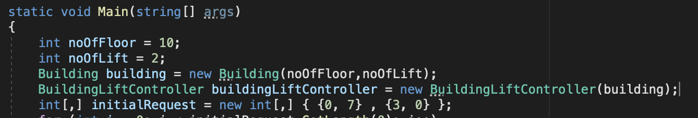
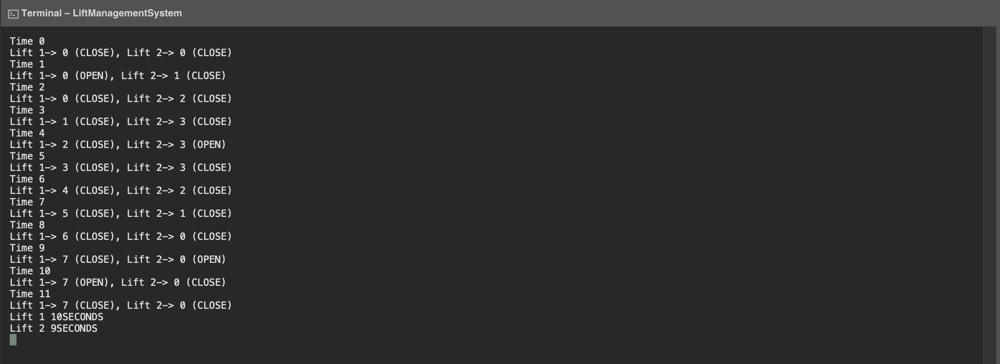

# Lift Management system
## Problem statement
The statement for the problem is [here.](Extras/problem.pdf)

The code input can be provided directly in the main function (hard coded) and displays output on console.
Input format:

Output:

This is how the output is displayed for the input test statement given.
